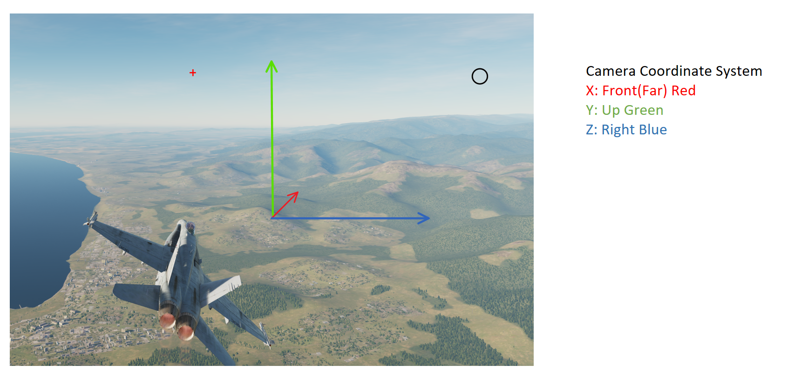

# DCS Plugin Development notes
## APIs
See https://wiki.hoggitworld.com/view/DCS_Export_Script

## DCS cooridnate system

north-up-east cooridnate system
x: north y: height z: east

General aviation (x', y', z')
north-east-down

DCS to Aviation
R_NUEtoNED = [
    [1, 0, 0],
    [0, 0, 1],
    [0, -1, 0]
]

## Matrix in DCS (guess is inherit from opengl)

R=LoGetCameraPosition()
Then
Transformation

[ [ R.x.x, R.y.x, R.y.x, R.p.x],
 [ R.x.y, R.y.y, R.z.y, R.p.y],
 [ R.x.z, R.y.z, R.z.z, R.p.z],
 [0, 0, 0, 1]]


## Camera Roatations
The Front of camera is it's x axis. up is +y, left is +z.

For camera
Rotation:
R = eye(3)
The view is point to north, left screen is west, right screen is east up down correct


euler_matrix(0, 0, np.pi/2)
    Rotate yaw + 90, the view is watch sky

euler_matrix(0, 0, -np.pi/2)
    Rotate yaw - 90, the view is watch ground

euler_matrix(pi/2, 0, 0) or euler_matrix(-pi/2, 0, 0)
    Watch north, no different with identity

euler_matrix(0, pi/2, 0)
    Watch west, up down correct

euler_matrix(0, -pi/2, 0)
    Watch east

So naive way is
Rcam_dcs = euler_matrix(0, view_yaw, -view_pitch)

Translation:
T = aircraft_pos + [0, 0, 0] # camera is near center of aircraft
T = aircraft_pos + [30, 0, 0] # camera is at north of aircraft
T = aircraft_pos + [0, 30, 0] # camera is at upward the aircraft
T = aircraft_pos + [0, -30, 0] # camera i at downward of aircraft

T = aircraft_pos + [0, 0, 30] # camera is at east the aircraft
T = aircraft_pos + [0, 0, -30] # camera i at west of aircraft

To convert cam pos to make it soround the aircraft

Tcam_ned = Rcam_ned*Toffset_ned
Tcam_dcs[1] = -Tcam_ned[2]
Tcam_dcs[2] = Tcam_ned[1]

In F11 view, you can freely write control. However the WSAD key will cause jiiter.
In F3 view, you can change the view by write the relative position (interesting), because it always foucs on the aircraft.

## python transformations
Common euler angles on aviation is ZYX, which is also default by python transformations.py
Here we use MATLAB as standard

```matlab
>> eul = [1.2 -0.2 0.4];
rotmZYX = eul2rotm(eul)

rotmZYX =

    0.3551   -0.8865    0.2966
    0.9135    0.2616   -0.3117
    0.1987    0.3817    0.9027
```

For use python transformations.py

we have

```python
>>> euler_matrix(0.4, -0.2, 1.2) # default is sxyz
array([[ 0.35513472, -0.88649883,  0.29664651,  0.        ],
       [ 0.91346036,  0.26164594, -0.31165939,  0.        ],
       [ 0.19866933,  0.3816559 ,  0.9027011 ,  0.        ],
       [ 0.        ,  0.        ,  0.        ,  1.        ]])
```

or 
```python
>>> euler_matrix(1.2, -0.2, 0.4, "rzyx")
array([[ 0.35513472, -0.88649883,  0.29664651,  0.        ],
       [ 0.91346036,  0.26164594, -0.31165939,  0.        ],
       [ 0.19866933,  0.3816559 ,  0.9027011 ,  0.        ],
       [ 0.        ,  0.        ,  0.        ,  1.        ]])
```