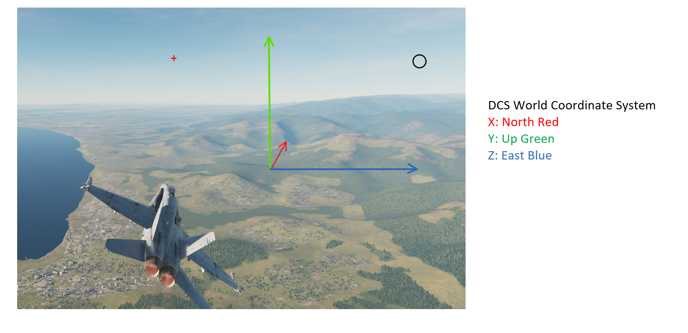

# Intro

## Usage

Delete all mouse view axis

Install DCSEasyControlExports to your "Saved Games/DCS/" Path

>python DCSEasyControl/main.py

Set DCS to F12 view.

## Implement Details

The reference and cooridnate system for DCS api please see this [doc](./doc/dcs.md).

## LICENSE
LGPL3
